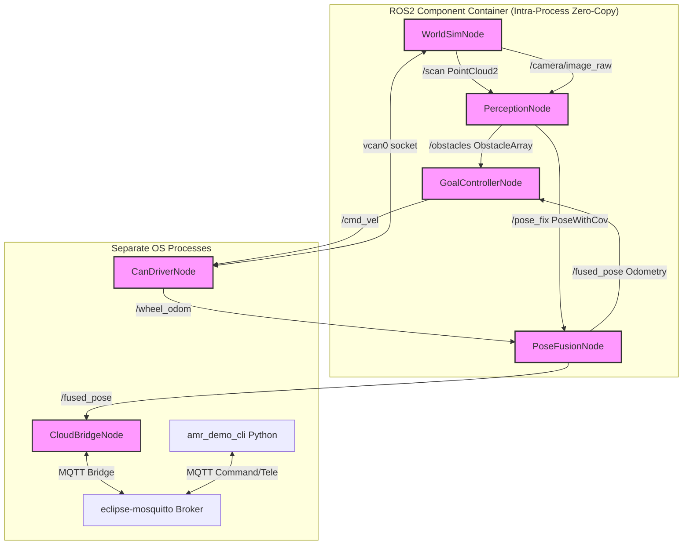

# Differential-Drive AMR Stack — Documentation

This document describes the architectural, mathematical, and logical design of the **`ros2_amr_stack`** project. 

The system simulates a differential-drive Autonomous Mobile Robot (AMR) navigating a warehouse environment. It fuses odometry with visual marker observations using an Extended Kalman Filter (EKF) and includes obstacle avoidance, path tracking, and cloud telemetry.

---

## 1. Architectural Overview

The project is structured as a **hybrid monorepo workspace**:
* **Standalone C++17 Libraries (`libs/`)**: Core algorithmic modules with no ROS2 dependency. Highly portable, fast to compile, and fully unit-testable using standard CMake + GoogleTest.
* **ROS2 Components (`src/`)**: ROS2 Humble wrappers (`rclcpp_components`) that package the standalone libraries into nodes, loaded into a single component container using intra-process zero-copy communication and a `MultiThreadedExecutor` for real-time efficiency.

---

## 2. Mathematical Foundations

### 2.1 Differential-Drive Kinematics (`world_sim_model` & `can_protocol`)

A differential-drive robot moves by controlling the angular velocities of its left and right wheels ($\omega_L, \omega_R$). Given a target linear velocity $v$ and angular velocity $\omega$, the individual wheel velocities are computed as:

$$v_L = v - \frac{\omega \cdot d}{2}$$
$$v_R = v + \frac{\omega \cdot d}{2}$$

where $d$ is the wheel track (the lateral distance between the wheels).

During simulation (`world_sim_model`), the wheel position integrates over time step $\Delta t$ using forward Euler integration:

$$\Delta s = \frac{\Delta s_R + \Delta s_L}{2}$$
$$\Delta \theta = \frac{\Delta s_R - \Delta s_L}{d}$$

$$\begin{bmatrix} x_{k} \\ y_{k} \\ \theta_{k} \end{bmatrix} = \begin{bmatrix} x_{k-1} + \Delta s \cos\left(\theta_{k-1} + \frac{\Delta \theta}{2}\right) \\ y_{k-1} + \Delta s \sin\left(\theta_{k-1} + \frac{\Delta \theta}{2}\right) \\ \theta_{k-1} + \Delta \theta \end{bmatrix}$$

Noise modeling: Gaussian noise is added to the simulated wheel encoder ticks to simulate slippage and wheel diameter inaccuracies.

---

### 2.2 Extended Kalman Filter (`pose_fusion_ekf`)

To mitigate raw odometry drift, a hand-written EKF fuses relative wheel odometry with absolute range and bearing measurements from simulated ArUco markers.

#### State Vector
The state vector $x_k$ represents the 2D pose of the robot:

$$x_k = \begin{bmatrix} x_k \\ y_k \\ \theta_k \end{bmatrix}^T$$

#### 1. Predict Step (Odometry Integration)
We advance the state $x_k$ using odometry delta distances $\Delta s_L, \Delta s_R$:

$$x_k^- = f(x_{k-1}, u_k)$$

The process covariance is projected using the Jacobian $F_x = \frac{\partial f}{\partial x}$:

$$F_x = \begin{bmatrix} 1 & 0 & -\Delta s \sin\left(\theta_{k-1} + \frac{\Delta \theta}{2}\right) \\ 0 & 1 & \Delta s \cos\left(\theta_{k-1} + \frac{\Delta \theta}{2}\right) \\ 0 & 0 & 1 \end{bmatrix}$$

$$P_k^- = F_x P_{k-1} F_x^T + Q_k$$

where $Q_k$ is the process noise covariance matrix derived from the encoder resolution and seeded slippage variance.

#### 2. Update Step (Visual Marker Observation)
When the robot camera detects an ArUco marker at a known landmark position $(x_m, y_m)$ in the world coordinate system, it provides a measurement vector $z_k$:

$$z_k = \begin{bmatrix} r_k \\ \phi_k \end{bmatrix} = \begin{bmatrix} \text{range (meters)} \\ \text{bearing (radians)} \end{bmatrix}$$

The non-linear measurement model $h(x_k^-)$ is defined as:

$$h(x_k^-) = \begin{bmatrix} \sqrt{(x_m - x^-)^2 + (y_m - y^-)^2} \\ \text{atan2}(y_m - y^-, x_m - x^-) - \theta^- \end{bmatrix}$$

We compute the measurement Jacobian $H = \frac{\partial h}{\partial x}$:

$$H = \begin{bmatrix} -\frac{x_m - x^-}{r} & -\frac{y_m - y^-}{r} & 0 \\ \frac{y_m - y^-}{r^2} & -\frac{x_m - x^-}{r^2} & -1 \end{bmatrix}$$

The Kalman Gain $K_k$ and updated state $x_k$ and covariance $P_k$ are:

$$S_k = H P_k^- H^T + R_k$$
$$K_k = P_k^- H^T S_k^{-1}$$
$$x_k = x_k^- + K_k (z_k - h(x_k^-))$$
$$P_k = (I - K_k H) P_k^-$$

*Note: Innovation bearing error ($z_k[1] - h(x_k^-)[1]$) is normalized to $(-\pi, \pi]$ to prevent filter divergence.*

---

## 3. Perception Pipeline (`perception_pipeline`)

The robot's perception system processes raw simulated lidar points and camera images:

1. **Lidar Obstacle Extraction (PCL)**:
   - Filters out the floor using `pcl::SACSegmentation` (fitting a horizontal Outlier/Ground Plane with RANSAC model `SACMODEL_PLANE`).
   - Clusters the remaining outlier points using `pcl::EuclideanClusterExtraction`.
   - Projects clusters into 2D circles characterized by `Centroid{x, y}` and `Radius`.
2. **Camera Marker Tracking (OpenCV)**:
   - Detects ArUco marker corners in camera images via `cv::aruco::detectMarkers`.
   - Computes marker pose (translation vector `tvec` and rotation vector `rvec`) relative to the camera frame via `cv::solvePnP`.
   - Converts `tvec` into range and bearing coordinates for the EKF update step.

---

## 4. Navigation & Control (`goal_controller`)

A proportional goal controller drives the robot to commanded destinations:

* **Alignment Phase**: If the heading error relative to the goal coordinates exceeds 0.5 rad, the robot performs an in-place rotation at a controlled angular velocity.
* **Approach Phase**: Once aligned, the robot drives forward, scaling down velocity linearly as it approaches the goal (slowdown radius $1.0\text{ m}$) and stops when within $0.05\text{ m}$.
* **Safety Corridor**: On every control cycle, the controller projects a forward safety corridor ($1.0\text{ m} \times \pm 0.4\text{ m}$). If any obstacle centroid detected by the PCL pipeline falls within this box, the robot immediately halts, sets an `obstacle_stop` status flag, and issues a zero-velocity command until the corridor is clear.
